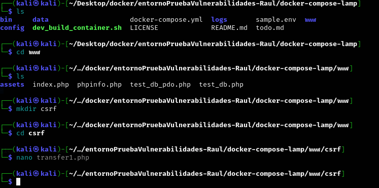
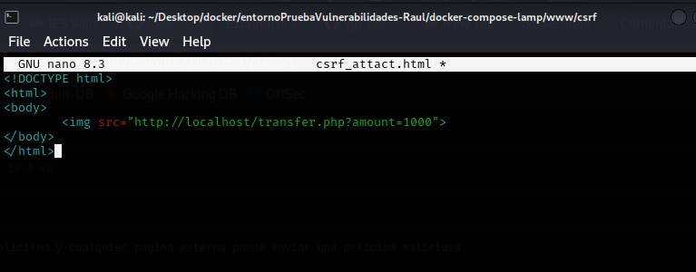

# PPS-Unidad3Actividad7-CSRF-RaulAlbalatPerez

## ACTIVIDADES A REALIZAR
> Lee detenidamente la sección de Inyección CSRF de la página de PortWigger <https://portswigger.net/web-security/csrf>

> Lee el siguiente [documento sobre Explotación y Mitigación de ataques de Inyección CSRF](./files/ExplotacionYMitigacionCSRF.pdf) de Raúl Fuentes. Nos va a seguir de guía para aprender a explotar y mitigar ataques de inyección Cross-Site Request Forgery (CSRF)>
 
> También y como marco de referencia, tienes [ la sección de correspondiente de ataque XSS reglejado de la **Proyecto Web Security Testing Guide** (WSTG) del proyecto **OWASP**.]<https://owasp.org/www-project-web-security-testing-guide/stable/4-Web_Application_Security_Testing/06-Session_Management_Testing/05-Testing_for_Cross_Site_Request_Forgery>

## Objetivo de la práctica

> Demostrar la explotación y mitigación de una vulnerabilidad CSRF en una aplicación web simulada.

## Código Vulnerable.

Lo primero que hago será crear el archivo `transfer1.php` dentro del entorno de desarrollo **lamp**. Dicho código es vulnerable está ubicado en la entidad bancaria y podemos realizar transferencia.

~~~
<?php
if ($_SERVER["REQUEST_METHOD"] == "POST") {
$amount = $_POST["amount"];
echo "Transferidos $$amount";
}
?>
<form method="post">
<input type="number" name="amount">
<button type="submit">Transferir</button>
</form>
~~~

Nos vamos a la URL y abrimos `transfer1.php`

## Explotación de CSRF

El atacante creará un archivo malicioso `(csrf_attack.html)`. Lo creo en la misma ruta que `transfer1.php`.

~~~
<!DOCTYPE html>
<html>
<body>
	
</body>
</html>
~~~

El usuario accdedería a esta URL. `http://localhost/csrf/csrf_attack.html`

​Este archivo no se encuentra en la web del banco, sino en un sitio controlado por el atacante. El enlace puede haber llegado al usuario por medios como correo electrónico o una página web falsificada.​

Al acceder a esta página, el navegador del usuario autenticado realiza automáticamente una solicitud al servidor del banco, aprovechando su sesión activa, lo que puede resultar en acciones no autorizadas sin que el usuario lo note.

- La imagen no se carga realmente.

- El navegador ejecuta la petición a transfer.php automáticamente.

- Se transfiere dinero sin que el usuario lo sepa.

Revisaremos el log de apache para confirmar el ataque. Para ello lo tenemos que ejecutar desde el contenedor docker qe es desde donde lo estamos ejecutando. en `/var/log/apache2/access.log`.

~~~
docker exec lamp-php83 /bin/bash -c "tail -5 /var/log/apache2/other_vhosts_access.log"
~~~

### ✅ Confirmación: CSRF ejecutado con éxito

- El registro del servidor muestra que el navegador realizó una solicitud GET a `transfer.php?amount=1000` desde `csrf_attack.html`.

- La respuesta del servidor fue un código 200 OK, indicando que la operación se completó sin intervención del usuario.

Esto evidencia que `transfer.php` es vulnerable a ataques CSRF, ya que no implementa medidas como la validación del origen de la solicitud o el uso de tokens de seguridad.

Una variante es que podemos insertar un formulario automático en una página legítima, con una estética muy parecida al diseño original, para engañar a la víctima.

Para ello creamos otro archivo el cual lo llamaremos `csrf_attack2.html`.

~~~
<!DOCTYPE<html>
<body>
        <form action="http://localhost/transfer.php" method="POST">
                <input type="hidden" name="amount" value="1000">
                <input type="submit">
        </form>
        
</body>
</html>
~~~

El usuario, al efectuar una transferencia, no se percata de que en realidad ha enviado el dinero a la cuenta del atacante.

### Confirmación: El ataque CSRF automático funcionó

El log indica que el navegador envió una solicitud POST a `transfer1.php` desde `csrf_attack2.html`.  
El servidor respondió con 200 OK, lo que significa que la transacción se ejecutó sin que el usuario lo notara.  
Esto confirma que `transfer.php` sigue siendo vulnerable a CSRF en solicitudes automáticas porque **NO** está validando un token CSRF en la petición POST.

### Mitigaciones
---
**Verificando que transfer.php está protegiendo correctamente con el token CSRF**
---

- Modificamos el archivo transfer1.php:
~~~
<?php
session_start();
// Generar un token CSRF si no existe
if (empty($_SESSION['csrf_token'])) {
        $_SESSION['csrf_token'] = bin2hex(random_bytes(32));
}
// Solo permitir solicitudes POST con un token CSRF válido
if ($_SERVER["REQUEST_METHOD"] == "POST") {
        if (!isset($_POST['csrf_token']) || $_POST['csrf_token'] !== $_SESSION['csrf_token']) {die("CSRF detectado. Acción bloqueada.");
        }
        $amount = $_POST["amount"];
        echo "Transferidos $$amount";
}
?>
<form method="post">
        <input type="number" name="amount">
        <input type="hidden" name="csrf_token" value="<?php echo $_SESSION['csrf_token']; ?>">
        <button type="submit">Transferir</button>
</form>
~~~

- Nos aseguramos de que el código tiene esta validación:

El uso del token CSRF evita que el atacante pueda enviar una solicitud legítima en nombre del usuario sin su consentimiento.

**Bloqueando Solicitudes CSRF con Encabezados HTTP**
---
Además del token CSRF, podemos bloquear peticiones automáticas exigiendo el encabezado X-Requested-With.

Modificar transfer1.php para agregar esta verificación. Creare otro llamado `transfer2.php`

~~~
session_start();
// Generar un token CSRF si no existe
if (empty($_SESSION['csrf_token'])) {
        $_SESSION['csrf_token'] = bin2hex(random_bytes(32));
}
// Solo permitir solicitudes POST con un token CSRF válido
if ($_SERVER["REQUEST_METHOD"] == "POST") {
        if (!isset($_POST['csrf_token']) || $_POST['csrf_token'] !== $_SESSION['csrf_token']) {
                die("CSRF detectado. Acción bloqueada.");
        }
// Bloquear peticiones que no sean AJAX legítimas
        if (!isset($_SERVER['HTTP_X_REQUESTED_WITH']) || $_SERVER['HTTP_X_REQUESTED_WITH'] !=='XMLHttpRequest') {
                die("CSRF detectado. Acción no permitida.");
        }

        $amount = $_POST["amount"];
        echo "Transferidos $$amount";
}
?>
<form method="post">
        <input type="number" name="amount">
        <input type="hidden" name="csrf_token" value="<?php echo $_SESSION['csrf_token']; ?>">
        <button type="submit">Transferir</button>
</form>
~~~

 
Probamos a ejecutar de nuevo csrf_attack2.html:

**Proteger con SameSite=Strict en Cookies**
---
Esta configuración impide que las cookies de sesión sean enviadas en solicitudes CSRF.
Editar la configuración de sesión en transfer2.php:

`session_set_cookie_params(['samesite' => 'Strict']);`

`session_start();`

Esto evitará que un atacante pueda robar la sesión en peticiones automáticas.

Probamos a ejecutar de nuevo csrf_attack2.html:

Aplicamos todas las mitigaciones:
~~~
<?php
// Configurar la cookie de sesión para bloquear ataques CSRF
session_set_cookie_params([
        'samesite' => 'Strict', // Bloquea solicitudes desde otros sitios
        'httponly' => true, // Bloquea acceso a la cookie desde JavaScript
        'secure' => false // Cambiar a true si usas HTTPS
]);
session_start();
// Generar un token CSRF si no existe
if (empty($_SESSION['csrf_token'])) {
        $_SESSION['csrf_token'] = bin2hex(random_bytes(32));
}
// Solo permitir solicitudes POST
if ($_SERVER["REQUEST_METHOD"] !== "POST") {
        die("Error: Método no permitido");
}
// 1️ - Validar que el token CSRF está presente y es correcto
if (!isset($_POST['csrf_token']) || $_POST['csrf_token'] !== $_SESSION['csrf_token']){
        die("CSRF detectado. Acción bloqueada.");
}
// 2️ - Validar que la solicitud proviene del mismo origen
if (!isset($_SERVER['HTTP_REFERER']) || parse_url($_SERVER['HTTP_REFERER'],PHP_URL_HOST) !== $_SERVER['HTTP_HOST']) {
        die("CSRF detectado: Referer inválido.");
}
// 3️ - Bloquear peticiones que no sean AJAX
if (!isset($_SERVER['HTTP_X_REQUESTED_WITH']) || $_SERVER['HTTP_X_REQUESTED_WITH'] !=='XMLHttpRequest') {
        die("CSRF detectado: No es una solicitud AJAX válida.");
}
// Si todas las validaciones pasan, procesar la transferencia
$amount = $_POST["amount"];
echo "Transferidos $$amount";
?>
<form method="post">
        <input type="number" name="amount">
        <input type="hidden" name="csrf_token" value="<?php echo $_SESSION['csrf_token'];
?>">
<button type="submit">Transferir</button>
</form>
~~~

Probamos a ejecuarlo.

Explicación de las correcciones:

- Bloquea todas las solicitudes GET (ya no se puede usar  para ataques CSRF).

- Verifica que el csrf_token coincida con el de la sesión.

- Verifica que la solicitud provenga del mismo dominio (HTTP_REFERER).

- Exige que las solicitudes sean AJAX (X-Requested-With: XMLHttpRequest).

